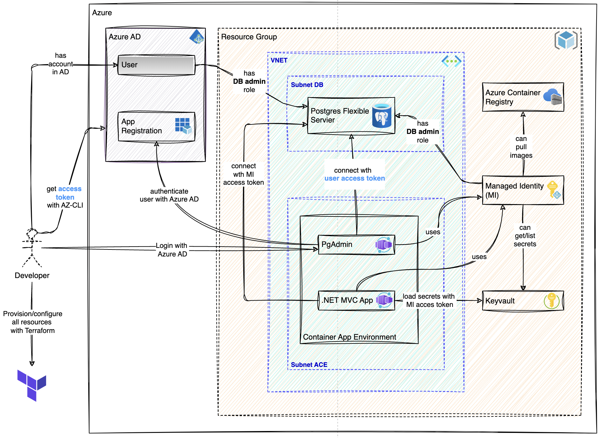

# Azure Managed Identity Sample

Welcome to the **Project Name** repository! This Proof of Concept (PoC) demonstrates a comprehensive infrastructure setup on **Microsoft Azure**. 
It uses **Terraform** to deploy resources, including a PostgreSQL Flexible Server with Azure AD authentication, a .NET MVC App, and secure access to secrets via Managed Identity (MI) and Key Vault.

> *This repository does not reflect the best devops architecture practices, it is aimed in that project to simulate the usage of managed identities for cross Azure service connections.*

 
## Project Overview

This project deploys an infrastructure that supports secure access and interactions across Azure services using Managed Identity and Azure AD roles. Key components include:

- **PostgreSQL Flexible Server**: Configured for access with Azure AD and Managed Identity tokens.
- **Key Vault**: Securely stores secrets that the application can access using Managed Identity.
- **Azure Container Registry**: Holds container images for deployment.
- **PgAdmin**: A tool for managing PostgreSQL, accessible via Azure AD tokens.
- **.NET MVC App**: A web application that loads secrets securely from Key Vault and query data from Postgres Flexible server.

The infrastructure is fully managed and deployed using **Terraform** without any backend, enabling easy provisioning, configuration, and cleanup, it is **not recommended** to do it in that way in productive environments. 

---

## Architecture Overview



### Components and Flow

1. **Developer**:
   - Authenticates with Azure AD to provision and configure resources using Terraform.
   - Uses Azure AD to log in and access the infrastructure (pgAdmin).

2. **Azure Active Directory (Azure AD)**:
   - Provides authentication and role assignments.
   - Supports **App Registration** for applications requiring specific permissions.

3. **PostgreSQL Flexible Server**:
   - Configured with AD admin roles.
   - Accepts connections using Managed Identity and user access tokens.

4. **PgAdmin**:
   - Used for managing and interacting with the PostgreSQL database.

5. **.NET MVC App**:
   - Hosted in a **Container App Environment** within a **Subnet ACE**.
   - Uses Managed Identity to load secrets securely from Key Vault.
   - Uses Managed Identity to access Postgres database.

6. **Managed Identity (MI)**:
   - Grants access to **Key Vault** for secret management.
   - Grants access to **Postgres** database as administrator.
   - Enables secure access to **Azure Container Registry** for pulling container images.

7. **Azure Key Vault**:
   - Holds sensitive information required by the application.
   - Managed Identity is used to grant access to retrieve secrets securely.

8. **Azure Container Registry**:
   - Stores container images required by the .NET MVC App.
  

## Prerequisites

Ensure the following tools are installed and configured:

1. **Azure CLI** – [Install Azure CLI](https://learn.microsoft.com/en-us/cli/azure/install-azure-cli).
2. **Terraform** – [Install Terraform](https://developer.hashicorp.com/terraform/downloads).
3. **Docker Engine** – [Install Docker](https://docs.docker.com/engine/install) to build and push container images to Azure Container Registry.
4. **Azure Account** – An active Azure account with permissions to create resources. 

---

## Setup

### Login to Azure
   
Log into your Azure account using the Azure CLI. This step authenticates your session, allowing Terraform to deploy resources securely.

```bash
az login
```

### Clone the Repository

```bash
git clone https://github.com/hasanuzun/azure-managed-identity-sample
cd azure-managed-identity-sample

```

### Initialize Terraform
```bash
cd ops/terraform
terraform init 
```

### Set variables

You can edit default values of the terraform variables existing in the [terraform.tfvars](ops/terraform/terraform.tfvars) file.


###  Deploying Resources

This command will deploy all resources, including VNET, subnets, PostgreSQL, Key Vault, and the .NET MVC app in a secure environment with Managed Identity for access control.

```bash
terraform plan -out=tfplan
terraform apply -auto-approve tfplan
``` 

## PostgreSQL Access with Azure AD Token

For secure access to PostgreSQL with Azure AD, generate an access token as follows:

````bash 

export PGUSER=$(az ad signed-in-user show --query "[userPrincipalName][0]" -o tsv)
export PGPASSWORD=$(az account get-access-token --query "accessToken" -o tsv --resource-type oss-rdbms)

echo "Username: $PGUSER"
echo "Password: $PGPASSWORD"

````

## Cleaning Up Resources

You can delete all resources created for this PoC with following commands.

```bash
terraform apply -destroy -auto-approve
```
 

# Resources

For additional context and guidance, refer to the following documentation: 

- https://learn.microsoft.com/en-us/azure/postgresql/flexible-server/how-to-connect-with-managed-identity
- https://learn.microsoft.com/en-us/cli/azure/authenticate-azure-cli
- https://learn.microsoft.com/en-us/azure/postgresql/flexible-server/how-to-configure-sign-in-azure-ad-authentication
- https://learn.microsoft.com/en-us/azure/developer/terraform/deploy-postgresql-flexible-server-database?tabs=azure-cli 